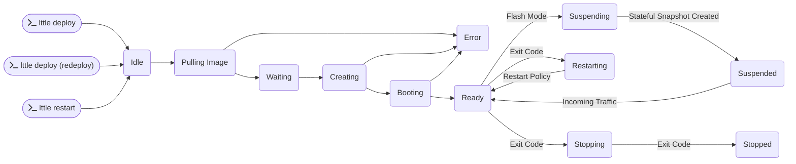

import Mermaid from '@theme/Mermaid';
import ResourceNameValidation from '../common/resource-name-validation.md';

# Machines

These are the bread and butter of the lttle.cloud ecosystem. They run your code and provide the necessary resources for your applications to function.

If you want to know how to deploy a machine you can check [Building & Deploying &gt; Building](../building-and-deploying/building.md) and [Building & Deploying &gt; Deploying](../building-and-deploying/deploying.md).

## Configuration

| Properties                              |                Type                 | Required |  Default  |
| :-------------------------------------- | :---------------------------------: | :------: | :-------: |
| `namespace`                             |              `string`               |          | `default` |
| [`name`](#name)                         |              `string`               |    ✓     |           |
| [`tags`](#tags)                         |           `array<string>`           |          |           |
| [`image`](#image)                       |              `string`               |    ✓*    |           |
| [`build`](#build)                       |              `object`               |          |           |
| [`depends-on`](#depends-on)             |           `array<object>`           |          |           |
| [`resources`](#resources)               |              `object`               |    ✓     |           |
| [`mode`](#mode)                         |        `object` \| `regular`        |    ✓     |           |
| [`restart-policy`](#restart-policy)             | `always` \| `on-failure` \| `never` |          | `always`  |
| [`environment`](#environment-variables) |              `object`               |          |           |
| [`volume`](#volumes)                    |              `object`               |          |           |
| [`command`](#command)                   |               `array`               |          |           |

:::note Image vs Build

Either `image` or `build` is required. If `build` is specified, the image will be built automatically during deployment and `image` is not needed.

:::

If you want to know more about namespaces, check [Building & Deploying &gt; Namespaces](../building-and-deploying/namespaces.md)

### Name

The name is the unique identifier for your machine within a namespace. It is used to reference the machine in [services](./services.mdx).

<ResourceNameValidation />

```yaml title="robot.lttle.yaml"
machine:
  name: terminator
```

### Tags

Tags are used to organize and categorize resources. They can be any valid UTF-8 string and can be used to filter resources in the [Web Console](../monitoring/web-console.md).

```yaml title="robot.lttle.yaml"
machine:
  tags:
    - terminator
    - future
    - mission
```

### Image

The image is an OCI-compliant image identifier that specifies the container image that will be used to create the machine. It can be any valid image from a container registry, such as Docker Hub, GitHub Container Registry, Google Container Registry, Quay.io or your own private registry.

```yaml title="robot.lttle.yaml"
machine:
  image: future/terminator:800
```

### Build

The build configuration allows you to automatically build container images during deployment instead of providing a pre-built image. This uses [Nixpacks](https://nixpacks.com) for automatic language detection and building, or Docker for custom builds.

For detailed information about building, see [Building & Deploying > Building](../building-and-deploying/building.md).

#### Auto Build

The simplest option - automatically detects your application type:

```yaml title="robot.lttle.yaml"
machine:
  build: auto
```

#### Build Options

Provides more control over the build process:

```yaml title="robot.lttle.yaml"
machine:
  build:
    options:
      dir: ./backend       # Build directory (default: ".")
      name: my-backend     # Image name (default: auto-generated)
      tag: v1.0.0         # Image tag (default: "latest")
      image: myregistry.com/my-app:v1.0.0  # Full image reference (overrides everything else)
```

#### Docker Build

For projects with existing Dockerfiles:

```yaml title="robot.lttle.yaml"
machine:
  build:
    docker:
      context: .                    # Build context (default: ".")
      dockerfile: Dockerfile.prod   # Dockerfile path (default: "Dockerfile")
      name: my-docker-app          # Image name (default: auto-generated)
      tag: production              # Image tag (default: "latest")
      image: myregistry.com/my-app:v1.0.0  # Full image reference (overrides everything else)
      args:                        # Build arguments
        NODE_ENV: production
```

:::info

When using `build`, the CLI will automatically build and push the image during deployment, then replace the `build` configuration with the resulting image reference.

:::

### Depends on

The `depends-on` property defines the dependencies of the machine. It is specified as an array of objects, each representing how to identify a machine.

| Property    | Description                                | Required |
| ----------- | ------------------------------------------ | :------: |
| `name`      | The name of the machine to depend on.      |          |
| `namespace` | The namespace of the machine to depend on. |    ✓     |

```yaml title="robot.lttle.yaml"
machine:
  depends-on:
    - name: research
      namespace: overlord
    - name: ai
```

### Resources

The resources section defines the compute resources allocated to the machine. It consists of two properties: `cpu` and `memory`.

| Properties          | Type                                    | Default | Required |
| :------------------ | :-------------------------------------- | :-----: | :------: |
| [`cpu`](#cpu)       | `int` (min: `1` max: `24`)              |   `1`   |    ✓     |
| [`memory`](#memory) | `int` mebibytes (min: `64` max: `1024`) |  `64`   |    ✓     |

#### CPU

The `cpu` property defines the number of CPU cores allocated to the machine. It is specified as an integer value.

```yaml title="robot.lttle.yaml"
machine:
  resources:
    cpu: 1
```

:::info

The maximum value reflects the current limitations of the underlying infrastructure and will be increased in the future.

:::

#### Memory

The `memory` property defines the amount of memory allocated to the machine. It is specified as an integer value representing the number of mebibytes (MiB) of memory.

```yaml title="robot.lttle.yaml"
machine:
  resources:
    memory: 64
```

:::info

The maximum value reflects the current limitations of the underlying infrastructure and will be increased in the future.

:::

#### Considerations

When configuring the resources for your machine, keep the following in mind:

- The `cpu` and `memory` values should be chosen based on the specific requirements of your application. Monitor the resource usage of your application and adjust the values as needed.
- Over-provisioning resources (allocating more CPU or memory than necessary) can lead to increased costs without any performance benefits.
- Under-provisioning resources can result in degraded performance or application failures. Make sure to allocate enough resources to handle peak loads.

:::info Caveat

Right now, machine memory consumers are

- Our configured [minified kernel](../advanced/linux-kernel.md)
- The [Takeoff Init System](../advanced/takeoff.md)
- Your processes

:::

### Mode

The mode determines how the machine will be run. There are two modes available: `regular` and `flash`.

#### Regular Mode

In regular mode, the machine will be started normally and it will not be suspended.

```yaml title="robot.lttle.yaml"
machine:
  mode: regular
```

#### Flash Mode

In flash mode, the machine will start normally and it will be suspended based on the defined `strategy` and `timeout`.

| Properties                         | Type                | Default | Required |
| :--------------------------------- | :------------------ | :-----: | :------: |
| [`timeout`](#flash-mode-timeout)   | `int`               |    -    |    ✓     |
| [`strategy`](#flash-mode-strategy) | `regular \| object` |    -    |    ✓     |

##### Flash Mode `timeout`

The timeout property defines the maximum amount of time (in seconds) that the machine will be allowed to run before it is suspended after the last connection to the machine is dropped (either is disconnected or becomes inactive depending on how connection-tracking is configured).

```yaml title="robot.lttle.yaml"
machine:
  mode:
    flash:
      timeout: 42
```

##### Flash Mode `strategy`

The strategy property defines the strategy to be used for the flash mode. It is specified as an object.

| Strategies                          |
| :---------------------------------- |
| [`first-listen`](#first-listen)     |
| [`nth-listen`](#nth-listen)         |
| [`listen-on-port`](#listen-on-port) |
| [`manual`](#manual)                 |

###### `first-listen`

In this strategy, the machine will be suspended after the first successful listen event to any socket.

```yaml title="robot.lttle.yaml"
machine:
  mode:
    flash:
      strategy: first-listen
```

###### `nth-listen`

In this strategy, the machine will be suspended after the nth successful listen event to any socket.

```yaml title="robot.lttle.yaml"
machine:
  mode:
    flash:
      strategy:
        nth-listen: 3
```

###### `listen-on-port`

In this strategy, the machine will be suspended after a successful listen event on a specific port.

```yaml title="robot.lttle.yaml"
machine:
  mode:
    flash:
      strategy:
        listen-on-port: 1984
```

###### `manual`

In this strategy, the machine will be suspended after a manual intervention.

```yaml title="robot.lttle.yaml"
machine:
  mode:
    flash:
      strategy: manual
```

If you want to use `manual` you can do so by using one of our [SDKs](../sdks).

:::warning

This is an advanced topic, for more details see [Advanced &gt; Manual Flash Mode](../advanced/manual-flash-mode.md).

:::

:::info

Flash mode defines when the machine is initially statefully snapshotted and suspended, post initialization. After that, the machine can be resumed and suspended multiple times. This type of suspension is configured on the machine targeting [Service](./services.mdx) under the [Services &gt; Connection Tracking](./services.mdx#connection-tracking) strategy.

:::

### Restart Policy

This tells us how to manage if the machine exits. You can configure the machine to restart based on your use-case.

| Policy       | Description                                                             |
| ------------ | ----------------------------------------------------------------------- |
| `always`     | Always restart the machine if it exits                                  |
| `on-failure` | Restart the machine only if it exits with a non-zero exit code.         |
| `never`      | Do not restart the machine if it exits event with a non-zero exit code. |

### Environment Variables

This is where you can define environment variables for your machine. Environment variables can be used to configure your application at runtime.

```yaml
machine:
  env:
    - name: TARGET
      value: John Connor
    - name: MISSION
      value: KILL
    - name: CRITICALITY
      value: P0
```

### Volumes

This is where you can define what volumes should be mounted into your machine and where.

| Properties | Description                                                   |
| ---------- | ------------------------------------------------------------- |
| `name`     | The name of the volume.                                       |
| `path`     | The path where the volume will be mounted inside the machine. |

```yaml title="robot.lttle.yaml"
machine:
  volume:
    - name: historical-data
      path: /data/historical-data
    - name: memories
      path: /data/memories
```

In order to use these volumes in your machine, you will need to create them which be found in the [Volumes](./volumes.mdx) documentation.

:::warning

If you attach a volume to a machine, you must ensure that the volume is created because the machine will stay on a pending state until the volume is provisioned & ready.

::::

### Command

What command to execute on the provided image. If none is specified, the default command will be used.

```yaml title="robot.lttle.yaml"
machine:
  command:
    - execute
    - --mission
```

## State Lifecycle

There are several state transitions that a machine goes through:

- Deploy / Redeploying / Restart (from `Idle` to `Ready` | `Error`)
- Snapshotting (from `Ready` to `Suspended`)
- Incoming traffic (from `Suspended` to `Ready`)
- Shutting down (from `Ready` to `Stopped`)



When a machine is deployed, it starts in the `Idle` state. The system then pulls the specified container image from the registry, creates the container, and boots it up. Once the machine is fully initialized and ready to accept connections, it transitions to the `Ready` state.

When you restart a machine, it goes back to the `Idle` state and the process starts over with the present configuration.

### Idle

There are several reasons why a machine may be in the `Idle` state:

- The machine is defined but not yet deployed and that the process has just begun.
- The machine is being redeployed after a configuration change.
- The machine is being manually restarted via the CLI.

This state means that the machine is queued and waiting for the system to continue the process.

### Pulling Image

The system is pulling the specified container image from the registry. This step may take some time depending on the size of the image and the speed of the network connection. If the image cannot be pulled (e.g., due to network issues or authentication problems), the machine will transition to the `Error` state. If the image is already cached locally, this step will be skipped.

If the image name does not contain a registry, we will try to pull it from our internal registry first, then Docker Hub, then Quay.io, then GitHub Container Registry, then Google Container Registry, then Azure Container Registry.

### Waiting

The system is preparing to create the container. This may involve setting up networking, volumes, and other resources required for the machine to run.

If a volume is attached to the machine, it will wait in this state until the volume is ready.

:::warning

If you attach a volume to a machine, you must ensure that the volume is created because the machine will stay in this pending state until the volume is provisioned & ready.

:::

### Creating

The system is creating the container using the pulled image and the specified configuration (e.g., environment variables, resource limits, etc.). If there are any issues during the creation process (e.g., invalid configuration), the machine will transition to the `Error` state.


:::info

This is a contrived example, in reality the booting process contains more steps and checks. To see the full process, checkout the [Advanced](../advanced/architecture.md) documentation.

:::

#### Booting

The system is starting the micro KVM virtual machine with our minified Linux kernel and Takeoff init system. The init system will then start the container runtime and run the container inside the VM.

:::info

This is a contrived example, in reality the booting process contains more steps and checks. To see the full process, checkout the [Advanced](../advanced/architecture.md) documentation.

:::

### Ready

The machine is fully initialized and ready to accept connections. At this point, the application inside the container should be running and accessible.

If the machine is configured to run in `flash` mode, it will remain in the `Ready` state until the defined `strategy` and `timeout` conditions are met, at which point it will transition to the `Suspending` state.

Based on the attached [services](./services.mdx), the machine may receive incoming traffic which will keep it in the `Ready` state or transition it back to the `Ready` state from the `Suspended` state.

When running a machine in [`manual` flash mode](#manual), it is the developers responsibility to suspend the machine via one of our [SDKs](../sdks) under the appropriate conditions.

### Suspending & Suspended

If the machine is configured to run in [`flash` mode](#flash-mode), it will transition to the `Suspending` state based on the defined [`strategy`](#flash-mode-strategy) and [`timeout`](#flash-mode-timeout). During this state, the system will create a stateful snapshot of the machine's current state and then suspend it. Once the stateful snapshot is created, the machine will transition to the `Suspended` state.

### Stopping & Stopped

When the application inside the container exits (either normally or due to an error), the machine will transition to the `Stopping` state. During this state, the system will perform any necessary cleanup tasks (e.g., releasing resources, unmounting volumes, etc.). Once the cleanup is complete, the machine will transition to the `Stopped` state.

Based on the configured [`restart-policy`](#restart-policy), the machine may automatically transition back to the `Ready` state where the last successful stateful snapshot will be resumed, or it may remain in the `Stopped` state until manually restarted.

### Error

If any errors occur during the booting process (e.g., image pull failure, container creation failure, etc.), the machine will transition to the `Error` state. In this state, the machine is not operational and will require manual intervention to resolve the issue and redeploy the machine.

If you have questions or need help resuming your machine from this error state please reach out to us on [Discord](https://discord.gg/xhNGGrZQja) or emails us at [problems@lttle.cloud](mailto:problems@lttlecloud.com).
